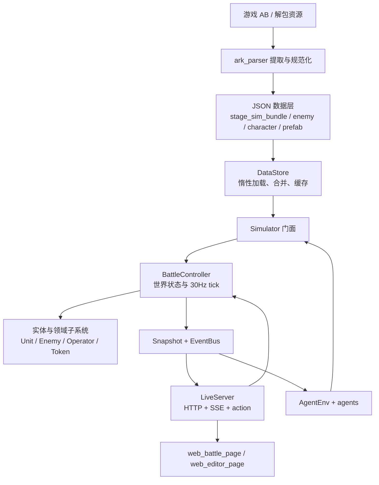

# Ark_emulator 工程架构

本文按当前源码整理模拟器的模块边界、运行时数据流和开发入口。结论标记如下：

- **已确认**：可在当前实现中直接找到类、函数、调用关系或文件格式证据。
- **概念分层**：为了理解而做的职责归类，不代表仓库中存在同名 package 或框架层。
- **推测/建议**：根据当前依赖方向提出的后续设计建议，不是现有保证。

相关概览见 [项目 README](../README.md)、[核心包 README](../ark_emulator/README.md) 与
[测试定向策略](TEST_SCOPING.md)。

## 1. 一句话总览

**已确认：** Ark_emulator 是一个以 `BattleController` 为战斗状态所有者、以固定
30Hz tick 驱动的 Python 模拟器。`DataStore` 把 ark_parser 生成的 JSON 和解包的
prefab/关卡资料装入运行时；`Simulator` 提供稳定的 Python 控制门面；`LiveServer`
把同一个模拟器实例包装成 HTTP、SSE 和静态网页控制台；`AgentEnv` 则将其包装成
agent 可 step 的交互环境。



## 2. 仓库结构与职责

| 路径 | 职责 | 证据状态 |
|---|---|---|
| `ark_emulator/api.py` | `Simulator` 公共门面，懒创建 battle，封装运行、部署、技能、撤退和 snapshot | 已确认 |
| `ark_emulator/battle.py` | `BattleController`，持有一场战斗状态、初始化关卡、驱动 tick 和操作 | 已确认 |
| `ark_emulator/entities.py` | `Unit` 基类及 `Enemy`、`Operator`、`Token` 运行时实体 | 已确认 |
| `ark_emulator/attributes.py` | 基础属性与四层 modifier 计算 | 已确认 |
| `ark_emulator/loader.py` | `DataStore`，加载 bundle、敌人/干员/技能/prefab/原始关卡并提供合并查询 | 已确认 |
| `ark_emulator/ai.py`、`skills.py`、`operator_skills.py`、`targeting.py` | 敌我行为、技能运行、索敌与攻击相关逻辑 | 已确认 |
| `ark_emulator/buffs.py`、`buff_templates.py`、`action_nodes.py` | Buff 生命周期、数据模板解释、能力图节点执行 | 已确认 |
| `ark_emulator/map.py`、`waves.py`、`projectiles.py`、`tile_effects.py` | 地图、寻路、刷怪调度、弹道和地形效果 | 已确认 |
| `ark_emulator/live_server.py` | 运行时线程、HTTP handler、SSE 客户端广播 | 已确认 |
| `ark_emulator/web_ui.py`、`web_battle_page.html`、`web_editor_page.html` | 页面加载器、战斗控制台和自定义关卡编辑器 | 已确认 |
| `ark_emulator/agent_env.py`、`agents.py` | agent step/reset/reward 接口与示例策略 | 已确认 |
| `data_*.json` | 提取产物及模拟器补充数据 | 已确认；具体文件依 README |
| `tests/` | 机制单测、领域回归、端到端及 UI/API 测试 | 已确认 |
| `examples/` | Python API、LiveServer、AI 和基准示例 | 已确认 |

**概念分层：** 可以把 `entities.py`、`attributes.py` 和 `consts.py` 看作领域数据模型，
把 `battle.py` 与机制模块看作领域服务/调度层；但源码没有独立的 `models/` package，
也没有 ORM、Pydantic schema 或数据库持久层。实体是普通 Python 对象，HTTP 边界使用
JSON 字典。

## 3. 数据架构

### 3.1 构建时数据流

**已确认：** 主体数据由仓库外部的游戏资源解包和 ark_parser 脚本生成，模拟器运行时
只读消费 JSON。主要输入包括：

- `ark_parser/enemy/data/stage_sim_bundle.json`：按 `levelId` 聚合的紧凑关卡数据，
  stage 到 level 的映射，以及 `enemyRoster`。
- `ark_parser/enemy/data/levels/<levelId>.json`：完整原始解析关卡，提供 tile 细节、
  checkpoints 等 bundle 未收录或压缩掉的字段。
- `ark_parser/enemy/data/enemy_database.json`：敌人基础数据与等级覆盖。
- `ark_parser/enemy/data/skill_behavior_catalog.json`、
  `skill_prefab_catalog.json`：敌人技能参数和 prefab 能力组件。
- `ark_parser/character/data/characters.json`、`skills.json`、模组/信赖数据：
  我方角色和技能养成数据。
- `Ark_emulator/ark_emulator/data_*.json`：当前版本 prefab、buff 模板、关卡资产映射、
  tile 定义、环境系统、弹道速度、Spine 事件等补充表。

数据源和正式产物以 [核心包 README](../ark_emulator/README.md) 及仓库根目录
“游戏更新后如何同步更新模拟器”章节为准。

### 3.2 运行时加载

**已确认：** `DataStore` 是数据访问适配器，不是纯字典容器：

1. 属性第一次访问时才读取对应 JSON（lazy loading）。
2. bundle 和 raw level 有进程级共享缓存，避免多个 `Simulator` 重复解析大文件。
3. `sim_level(level_id)` 从 bundle 取模拟需要的精简 level。
4. `raw_level(level_id)` 优先按 `data_level_assets_index.json` 找原始 `.bytes` 并解析；
   不可用时退回 `data/levels/<id>.json`。
5. `merged_map`、`merged_routes` 等辅助函数把紧凑 bundle 与 raw level 信息合并，
   供战斗初始化使用。
6. `stage_to_level(stage_id)` 通过 bundle 的 `stages` 映射 stage ID。

**开发提示：** 调整数据 schema 时要同时检查 parser 输出、`DataStore` 的读取/合并、
运行时消费者及对应数据 fixture；只改某个 JSON 示例不代表加载路径已经兼容。

## 4. 概念上的 Model / 领域状态

以下是对现有类的概念归类，不是独立的软件层。

### 4.1 实体与数值

- `Unit` 是共同基类，维护 `inst_id`、位置、HP/SP、`Attributes`、buff、异常状态、
  barrier 等状态，并提供伤害/治疗和快照转换。
- `Enemy` 增加 enemy key/level、路线游标、状态机状态、阻挡关系和敌方技能控制器。
- `Operator` 表示玩家可部署干员，保存干员配置、朝向、部署时刻和技能状态。
- `Token` 表示召唤物、装置或其他场上单位。
- `Attributes` 保存 base 值与 modifier，并按需计算有效值。四层是 `add`、`mul`、
  `final_add`、`final_mul`；Buff 不必每次直接改写基础属性。
- `TileData` 表示静态/运行时可覆写的地图格属性；`GameMap` 管理网格、路线查询和寻路缓存。
- 快照使用 `to_dict()` / `snapshot()` 转成 JSON-safe 基础类型；运行时对象引用会转成
  `inst_id` 等标识，避免 HTTP JSON 序列化持有整个对象图。

### 4.2 战斗状态所有权

**已确认：** `BattleController` 是一场战斗的主要状态所有者，直接持有地图、敌人、干员、
Token、弹道、Buff 系统、波次调度器、事件总线和活动机制 manager。它不是只负责调度的
无状态服务。修改核心规则时要留意跨模块对该对象字段和方法的直接访问。

**推测/建议：** 目前这种共享 battle context 便于快速复刻互相耦合的游戏机制，但模块间
契约较隐式。新增机制优先沿用既有 helper / manager 和事件，不要再引入另一套平行的
全局状态；如果未来要拆分，可先整理 battle context 的稳定接口，再渐进迁移消费者。

## 5. 模拟核心与 tick 生命周期

### 5.1 创建链

```text
Simulator(level_id, squad, ...)
  └─ DataStore
      └─ Simulator.battle 首次访问时懒创建 BattleController
          ├─ 取 sim_level + raw_level
          ├─ 合并地图/路线，创建 GameMap / TileData
          ├─ 加载 options、runes、随机数种子
          ├─ 初始化预部署单位、实体容器、BuffSystem
          ├─ 创建 runtime wave scheduler / custom enemy scheduler
          └─ 创建地形、PRTS、活动机制 manager
```

自定义关卡走 `custom_levels.normalize()`，再被转换成 battle 初始化使用的 level 形状；
这让 `BattleController` 可复用大部分相同逻辑。

### 5.2 每 tick 顺序

**已确认：** `TIME_ROUGH_LOGIC_RATE = 30`，`dt = 1/30` 秒。当前 `tick_once()` 大致顺序：

1. 波次和自定义敌人调度，处理已触发的分支 phase。
2. 更新敌方 AI、移动/技能/攻击，并检测地形重叠和陷阱触发。
3. 推进 PRTS manager、干员行为与 HP regen。
4. 更新阻挡关系及敌我天赋 aura。
5. 更新 Buff/异常、活动管理器与特殊护盾。
6. 更新弹道、地形效果和技能产生的动态地块。
7. 按有效计时规则恢复费用、清理死亡单位、判定结算，然后 tick 递增。

新增规则要先确定它属于哪个阶段，以及同 tick 中依赖/事件的先后关系；应尽量加入
`battle.py` 已有阶段，而不是从外围定时器异步推进战斗状态。

### 5.3 机制模块

- 敌人行为：`ai.py`、`skills.py`、`targeting.py`。
- 干员行为：`operator_skills.py`、`talents.py`、`traits.py`。
- 通用能力执行：`buffs.py`、`buff_templates.py`、`action_nodes.py`。
- 战斗结算：`damage.py`、`attributes.py`、`projectiles.py`。
- 调度/场景：`waves.py`、`map.py`、`tile_effects.py`、`predefines.py`。
- 特殊子系统：`prts.py`、`act31.py`、`act35.py` 等 manager 由 battle tick 驱动。

## 6. 事件、快照与外部 API

### 6.1 事件总线

**已确认：** `EventBus` 负责创建带 `seq/tick/t/type/data` 的事件并保留日志，当前有
`enemy_spawn`、`damage`、`skill_cast`、`deploy`、`battle_end` 等类型。模块可以在进程内
订阅事件；snapshot 可通过 `since_seq` 只取增量事件。

这不是消息队列服务：事件同步产生于模拟过程，主要用于观测、测试、回放/AI 信息，不负责
持久化或跨进程可靠投递。

### 6.2 Python API

**已确认：** `from ark_emulator import Simulator` 是公开入口。常见接口：

- 创建：`Simulator(level_id=..., stage_id=..., squad=..., custom_enemies=..., custom_level=...)`
- 推进：`run(seconds=...)`、`run_ticks(n)`、`tick_once()`
- 控制：`pause()`、`resume()`、`step(n)`
- 操作：`deploy()`、`deploy_summon()`、`deploy_token()`、`withdraw()`、`activate_skill()`
- 观测：`snapshot(since_seq=...)`

修改 public API 时注意 `LiveServer`、`AgentEnv`、examples 和测试都是直接调用方。

### 6.3 HTTP / SSE

**已确认：** `LiveServer` 在本机 `127.0.0.1` 上启动标准库 HTTP server，并由后台线程
推进模拟器。主要接口：

- `GET /`：战斗控制台 HTML。
- `GET /snapshot`、`GET /events?since=N`：状态和事件查询。
- `GET /stream`：SSE；后台按周期推进后广播 snapshot/event batch。
- `GET /levels`、`/enemies`、`/operators`：搜索/选择器数据。
- `GET /status`、`/config`、`/custom-levels`、`/tiles`：状态、配置与编辑器数据。
- `POST /action`：部署、召唤、撤退、技能、暂停/继续、速度、重启、单步。
- `POST /config`、`/squad`、`/custom-level`：编队、自定义敌人和自定义关卡。

这是轻量开发/研究服务，使用 Python 标准库 HTTP server，没有 FastAPI/ORM 等后端框架。
路由和请求体目前直接写在 `live_server.py`，接口变更应同步更新静态网页和
`test_live_server_chain.py` / `test_ui_click_flow.py`。

## 7. 前端结构

**已确认：** 当前不是独立 npm 前端工程。战斗页面和编辑器是静态 HTML/CSS/JavaScript：

- `web_battle_page.html`：当前优先使用的战斗控制台页面；包含地图、编队、选择、部署、
  单位检查器和事件显示逻辑。通过 `EventSource('/stream')` 接收实时状态，必要时也请求
  `/snapshot`。
- `web_editor_page.html`：绘制地图格、放置敌人、编辑路线/选项并提交 JSON 的简易关卡编辑器。
- `web_ui.py`：提供 `page_html()` / `editor_html()` 文件读取器；独立 HTML 读取失败时
  回退到模块里的内嵌旧页面字符串。
- `LiveServer`：负责托管页面和 HTTP API；`run_web.py` 创建默认 `Simulator` 与 server，
  可指定初始关卡、端口和是否自动开浏览器。

**推测/建议：** 若改页面布局/交互，先编辑独立 HTML 文件，保留 fallback 的同步策略；
若只是增加新 API，先定请求/响应 JSON 合约，再改 handler、页面调用和实时链路测试。

## 8. AI 与自动化调用

`AgentEnv` 把 `Simulator` 包成 `reset()` / `step(action)` / `observe()`：观测默认来自
全量 battle snapshot；step 应用 deploy/withdraw/skill 等动作，推进一个 tick，再按击杀、漏怪、
部署、技能、伤害和终局计算可配置 reward。`GreedyDefender`、`BeamAgent` 等策略消费这个
环境接口，而不是直接实现战斗规则。

开发新的 agent 时，优先在 `agent_env.py` 定义 action/observation/reward 合约，策略代码放在
`agents.py` 或独立使用方；不要把 agent 决策逻辑塞入 `BattleController`。

## 9. 建议的开发导航

| 修改目标 | 首看位置 | 定向验证 |
|---|---|---|
| 数据文件缺失/字段变化 | `ark_parser` 产物、`loader.py`、`project_paths.py` | `test_level_loading.py` / 对应数据测试 |
| 敌人移动、状态、索敌 | `entities.py`、`ai.py`、`targeting.py`、`map.py` | `test_enemy_*`、`test_search_tick.py`、`test_path_smoothing.py` |
| 波次与分支时序 | `waves.py`、`battle.py` | `test_wave_timing.py`、`test_branch_phases.py` |
| 干员部署/技能/天赋 | `battle.py`、`operator_skills.py`、`talents.py`、`traits.py` | 对应干员专项、`test_operator_skills.py` |
| Buff、异常、元素损伤 | `buffs.py`、`buff_templates.py`、`damage.py` | `test_buff_templates.py`、`test_abnormal.py`、`test_damage_matrix.py` |
| 快照/API 字段 | `entities.py` 的 `to_dict()`、`battle.py` 的 `snapshot()`、`api.py` | `test_live_server_chain.py`、`test_ui_click_flow.py` |
| 网页控制台/编辑器 | `web_battle_page.html`、`web_editor_page.html`、`live_server.py` | `test_editor.py`、`test_ui_click_flow.py` |
| agent 决策接口 | `agent_env.py`、`agents.py` | `test_agent_env.py`、`test_agents.py` |
| battle 核心 tick、通用加载器或公共 snapshot | 对应核心模块 | 按 `TEST_SCOPING.md` 扩大回归；必要时全量 `pytest tests` |

## 10. 主要设计约束与未封装处

- **确定性**：战斗 RNG 由 seed 创建并在 battle 生命周期内推进；复现 bug 时固定 `seed`、
  `level_id`、squad 与动作序列。
- **坐标约定**：公共坐标是左上原点 `(row, col)`；游戏导出的底部原点/地图 cells 在加载时
  转换，前端不要重复翻转。
- **快照兼容**：LiveServer、网页与 AgentEnv 共用快照字段；修改字段时保持旧消费者兼容或
  同步迁移所有 consumer。
- **tick 顺序**：周期性状态与动作的先后受 `BattleController.tick_once()` 阶段排序影响。
- **数据体积**：bundle/原始关卡较大，新增缓存或并行加载前要评估多实例内存；现有
  `DataStore` 已有进程级共享缓存。
- **当前耦合**：许多机制直接接收/访问 `BattleController`，部分扩展状态也由其持有；目前没有
  插件注册框架或正式依赖注入容器。
- **机制证据等级**：`mechanics_spec.md`、`docs/MECHANICS.md` 和子系统文档中含有推断/近似，
  新行为应记录来源和置信度，并补上最小回归案例。
