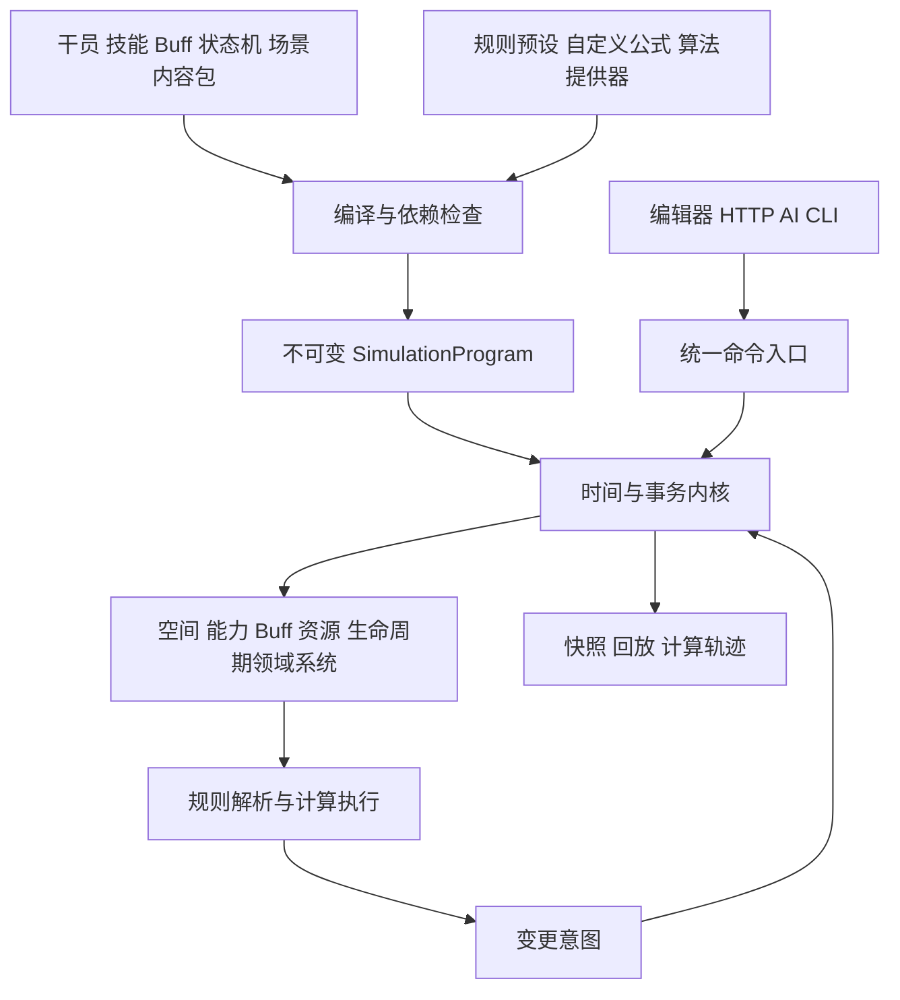

# Ark 通用模拟底座新版架构

本版按用户最新需求设计一套重新建立底层抽象的模拟平台。干员、敌人、技能、Buff、状态机与场景由内容包定义；属性、伤害、资源、时间、移动、索敌、阻挡和结算由可替换规则集执行。明日方舟作为平台上的规则预设和内容包，0-1 仍是首个真实机制验收关卡。

独立 V2 运行时已写入 `ark_sim`，包含内核、规则解释与计算图、编译器、领域执行、Builder、CLI、回放与检查点。实际支持及明确限制见 [V2_IMPLEMENTATION.md](V2_IMPLEMENTATION.md) 和 [V2_AUTHORING.md](V2_AUTHORING.md)。本文保留整体设计目标，后续数值后端、部分复杂机制和热切换不视为已经实现。`ark_emulator/core` 属于阶段一参考，不是新版基类或运行依赖。

需求见 [REQUIREMENTS.md](REQUIREMENTS.md)，创作样例见 [CUSTOM_CONTENT_V2.md](CUSTOM_CONTENT_V2.md)，计算契约见 [V2_RULE_CATALOG.json](V2_RULE_CATALOG.json)。文中的类型和 API 是拟定契约。

## 设计目标与范围

本轮全面重做底层规则表达和执行方式，内容覆盖仍按关卡推进。首个交付需要同时运行自定义干员、自定义技能、自定义公式的合成场景，以及明日方舟 0-1 的固定配置。

维护者应能通过 JSON 定义常见干员、技能和 Buff，通过公式配置改变数值，通过规则提供器替换复杂算法。一个新技能只要由已有原语组合，就无需新增角色专用类。复杂新机制可以提供独立插件，不需要修改内核。

通用性以可验收行为定义：同一底座运行两个不同规则集，产生预期差异；同一实体使用不同能力规则；任意内容 ID 能创建有效单位；所有公开数值规则有明确输入、输出、作用域和版本。账户、支付、基建与完整游戏画面仍不属于首版范围。

## 三个组成部分



1. **模拟内核**：保存状态、处理逻辑时间、调度任务、提交事务、记录事件和回放。它不包含防御减伤、30Hz、精英化、部署费用、SP 或具体角色知识。
2. **领域系统与规则运行时**：处理能力、资源、Buff、空间和生命周期的通用流程，向规则接口提交输入，接收结果和变更意图。
3. **规则预设与内容包**：描述游戏数值和具体对象。`ark.standard` 提供待校准的明日方舟规则，自定义包可以覆盖其中任意开放计算或策略。

系统调度的阶段顺序来自规则集的计划，内核只保证该计划确定执行。静态定义与编译结果共享只读；实体状态、随机数、资源和计时器在每场模拟内独立。

## 新版代码与内容目录

新版建议使用独立包名 `ark_sim`，避免误导调用者以为阶段一已经满足新版契约。

```text
Ark_emulator/
  ark_sim/
    kernel/
      session.py          一场模拟的执行入口
      world.py            实体与组件存储
      clock.py            整数逻辑时间与量化配置
      scheduler.py        稳定顺序的任务队列
      transaction.py      状态变更与提交
      events.py           事件与因果关系
      random.py           命名随机数流与消耗记录
      snapshot.py         状态导出与恢复
    contracts/
      components.py       可扩展组件类型
      commands.py         指令及结果类型
      intents.py          通用变更意图
      evaluation.py       规则输入输出上下文
      providers.py        算法扩展接口
    rules/
      catalog.py          开放计算和策略契约
      resolver.py         作用域与规则绑定
      expressions.py      表达式解释与类型检查
      pipeline.py         有类型的计算图
      numeric.py          精度 舍入 数值后端
      trace.py            逐阶段计算轨迹
    domains/
      attributes/         属性依赖与修饰器集合
      resources/          HP SP 费用及自定义资源
      abilities/          激活 阶段 命中 中断
      effects/            效果原语与事件反应
      buffs/              叠层 周期 到期与来源
      behavior/           状态图与正交约束
      spatial/            地图 路线 索敌 阻挡 弹道 位移
      lifecycle/          出生 死亡 复活 漏怪 终局
    content/
      schemas/            定义 schema 与版本
      compiler.py         内容和规则编译
      dependencies.py     传递依赖与动态引用检查
      repository.py       按 ID 与版本读取定义
      overlays.py         继承与覆写
      packages.py         命名空间与包锁定
    tools/
      authoring.py        定义校验与组合辅助
      inspect.py          内容依赖和规则解释
      replay.py           输入重放与检查点恢复
      compare.py          首次状态与计算差异
    adapters/
      api.py              外部 Python API
      http.py             HTTP 与状态推送
      agent.py            AI 环境
      imports/            现有游戏数据转换
  presets/
    ark_standard/         游戏规则集与领域提供器
  packages/
    ark_content/          导入后的单位与关卡
    custom/               用户创作的内容与规则包
  scenarios/
    sandbox/              自定义内容与规则验收场景
    level_main_00_01/     首个官方关卡输入与证据
  tests_v2/
    kernel/ rules/ domains/ authoring/ scenarios/
```

首版实现这些边界中的必要接口与能力，不创建返回成功的空处理器。未实现项由能力检查报告。已有包不会被改名后当成新版实现；新运行路径不导入旧 `ark_emulator` 的战斗、属性、伤害、路线、波次或 RNG 实现。离线导入器可以读取旧提取产物。

## 实体与组件模型

统一使用 `EntityDefinition` 表示干员、敌人、召唤物、装置和弹道。角色分类是标签和组件组合，不决定必须继承哪一个具体 Python 类。

| 组件 | 定义内容 | 运行时内容 |
|---|---|---|
| AttributeSet | 属性名称 类型 基础值 成长规则 | 有效值 修饰器来源 缓存版本 |
| ResourceSet | 任意资源的容量 变化和阈值规则 | 当前值 恢复计时器 |
| Spatial | 坐标与地图关联 占用和移动规则 | 位置 路线游标 位移状态 |
| AbilitySet | 普攻和技能引用 激活输入 | 当前施放 目标 时间线任务 |
| BuffContainer | 可接受的 Buff 与冲突规则 | Buff 实例 层数 黑板 |
| BehaviorMachine | 状态图 转换条件 约束引用 | 当前状态 各状态计时器 |
| Deployable | 部署输入与限制规则 | 在场状态 重部署历史 |
| Lifecycle | 出生 死亡 复活和离场规则 | 当前阶段及原因事件 |

`hp`、`sp`、`dp` 是明日方舟预设中的资源 ID。自定义干员可以使用 `energy`、`ammo`、`heat` 等资源，不需要向内核添加字段。HP 归零是否死亡、是否复活、是否保留尸体由生命周期规则决定。

组件定义经 schema 验证后可以扩展。内核固定的是实体身份、组件版本、事件身份和事务结构；具体数值含义属于规则集。

内容定义 ID 与运行时实体 ID 分开。场景可给初始实体分配别名，编译后映射到本场实体身份；指令引用实例，不能在多个同定义单位在场时仅凭干员定义 ID 猜测目标。

## 全部数值计算的统一接口

每个领域通过 `CalculationRequest` 调用规则运行时，不在流程代码中直接写业务公式。

```text
CalculationRequest
  calculation_id       例如 damage.mitigation
  inputs               有类型 有单位的输入
  scope                场景 来源实体 目标实体 能力 效果
  read_view            本次计算采用的状态快照
  rule_binding         编译后的规则绑定

CalculationResult
  outputs              校验后的结果
  trace                输入 规则 每阶段中间值 舍入与结果
  rule_fingerprint     所用规则和提供器版本
```

计算提供三种方式：

| 方式 | 适用情况 | 修改方式 |
|---|---|---|
| 表达式 | 伤害 属性成长 恢复 间隔 倍率和阈值 | 修改 JSON 中的公式和参数 |
| 计算图 | 多阶段减伤 穿透 护盾 取整和条件分支 | 增删 有序组合或替换有类型阶段 |
| Python 提供器 | 寻路 复杂选择器 特殊状态机或新算法 | 注册独立模块实现明确契约 |

表达式由独立解释器执行，读取已声明的输入、属性和参数。表达式不直接修改状态。规则提供器也通过只读上下文计算，修改动作以意图返回。随机数使用单独的随机采样操作，样本作为公式输入，避免隐藏消耗。

计算图可以调整阶段顺序，但编译器必须检查阶段输入输出及依赖。替换公式和替换整条计算管线都是第一类功能，不能只开放若干常数。

提供器契约分为计算与效果两类。计算返回结构化结果，效果返回意图批次；它们没有直接写 World 的入口：

```text
CalculationProvider.evaluate(request, read_context) -> CalculationResult
PolicyProvider.decide(request, read_context) -> PolicyResult
EffectProvider.plan(effect_context, calculation_service) -> IntentBatch
```

提供器声明读取字段、契约版本、参数 schema 和依赖。返回值按契约的输出 schema 校验；表达式和提供器结果采用相同的 NumericProfile 与量化规则。依赖属性有循环时，编译阶段报告完整引用链。

## 数值与策略开放清单

详细的 ID、输入输出、所有者和可替换实现见 [规则契约清单](V2_RULE_CATALOG.json)。下表是开发必须覆盖的领域。

| 领域 | 开放计算 | 开放策略 |
|---|---|---|
| 时间 | 秒转逻辑时间 前摇 后摇 周期量化 | tick 频率 同时事件优先级 系统阶段顺序 |
| 属性 | 成长 潜能 信赖 模组 修饰器每层结果 | 属性依赖图 层顺序 同来源叠加与冲突 |
| 伤害 | 基础威力 穿透 防御法抗 暴击 闪避 保底 伤害增减 | 类型映射 结算图 护盾顺序 无敌与伤害接受 |
| 治疗 | 治疗量 加成 衰减 过量和转盾 | 可治疗目标 免疫 过量分配与资源写入 |
| 资源 | 上限 恢复 消耗 溢出 充能 | 满值行为 技能期间恢复 多资源支付 |
| 部署 | 初始费用 重部署费用 退款 冷却 容量 | 地形 位置 占用 允许单位和费用支付方式 |
| 能力 | SP 成本 CD 次数 命中间隔 持续时间 | 激活方式 时间线 中断 目标锁定 属性取值时机 |
| Buff | 持续 周期 层数 每层数值 | 刷新 驱散 冲突 派生 来源与死亡清理 |
| 空间 | 速度 距离 力量 重量 位移量 弹道飞行 | 寻路 拓扑 范围 目标排序 阻挡和命中 |
| 关卡 | 波次延迟 出场数量 漏怪扣点 评分 | 条件分支 随机组 预部署 胜负和阶段结束 |
| 行为 | 状态阈值 阶段计时 触发概率 | 状态图 状态约束 转换优先级 |

“每块可自定义”指所有公开计算和策略都能替换，而不是所有模块必须使用同一种表达式。事务提交、身份分配和回放版本校验属于底座的一致性契约，不作为伤害插件任意改变。

## 规则绑定与覆写

基础优先级为：规则预设、场景规则、规则所有者实体、该实体的组件与属性或资源、能力、效果、显式调用绑定。后一级只覆盖指定计算 ID，其余规则继承已有绑定。组件与属性或资源作用域使同一单位的 HP、energy 和不同属性可以采用不同算法。运行时不使用隐式的最后导入获胜规则。

每个计算 ID 声明所有者：

- 来源所有：攻击威力、施放间隔等读取来源实体的规则。
- 目标所有：目标属性、抗性、生命资源限制等读取目标实体的规则。
- 场景所有：总体伤害结算图、阶段顺序和终局规则读取场景绑定。
- 能力或效果所有：该能力的成本、命中次数、专属倍率与显式结算覆盖。

当同一作用域中两份覆盖无法确定优先级时，编译失败并显示冲突来源。目标 Buff 通常产生明确的输入修饰器或伤害调整记录，不自动夺取来源实体的全部规则。

规则绑定在编译阶段解析为句柄。高频计算不反复扫描 JSON 和导入模块。每次结果仍能解释实际使用的规则与覆盖来源。

## 技能与效果组合

`AbilityDefinition` 统一描述普攻、主动、自动、被动触发和部署触发能力。激活方式、成本、目标、前摇、时间线、命中、中断和结束均为定义或规则绑定。

能力时间线支持按相对时间执行效果、有限重复、条件分支、延迟任务和可取消任务。循环效果必须有终止条件。效果原语包括伤害、治疗、修改资源、施加或解除 Buff、生成单位、位移、状态转换、改变地形、发事件和安排任务。

例如“消耗 20 能量，攻击力加 50% 持续 5 秒，范围内连续命中三次，每次返还 2 能量”由成本、Buff、目标选择、重复伤害和命中后资源变化组合，不新建 `CustomGuardSkill` 类。

每个效果声明属性读取时机：施放时、发射时或命中时。目标属性、来源属性和目标集合可以分别指定。弹道只携带能力与效果上下文及其取值方式，不能内置一个固定伤害结算。

## Buff 与状态机

Buff 由事件订阅、条件、效果、属性修饰、持续与叠层策略组成。触发可以是获得 Buff、周期到达、攻击开始、命中前后、受伤前后、资源变化、死亡或其他注册事件。

叠层策略按定义选择独立实例、加层、刷新、延长、取最大值或自定义提供器。上限、持续和周期分别走规则计算。来源消失、目标死亡和派生 Buff 的清理规则也可替换。运行时黑板属于实例，模板保持只读。

状态机可声明状态、条件、有序转换、进入/退出效果、局部计时器及子状态图。移动、能力执行和异常约束分别组合。普通地面近战行为定义在规则预设中；复杂 Boss 状态机可以使用 JSON 状态图或提供器，但仍通过同一效果与数值接口执行。

## 事务与事件执行

内核接收领域系统产生的变更意图。最小意图为组件字段变更、实体创建或移除、事件发布、任务安排或取消。领域效果先解析成这些意图，再经事务校验和提交。

一次资源支付和能力启动必须原子执行：校验不足时不扣除任何资源，不生成部分任务。伤害事件读取哪个前后状态由事件契约规定；死亡、复活和后续反应由提交后的事件队列推进。

稳定顺序使用逻辑时间、阶段、显式优先级和单调序号。排序字段如何映射和系统阶段如何排列在调度预设中定义。循环反应超过预设预算时报告因果链与失败位置，不静默吞掉。

快照读取提交后的确定状态。外部请求进入统一命令队列，网页和 AI 不直接写实体。运行倍速仅改变墙钟推进频率。

## 数值精度与可解释性

`NumericProfile` 指定数值后端、精度、舍入、量化和误差比较方式。首版使用统一浮点后端，并对游戏要求的整数边界显式量化；定点或 Decimal 通过后端契约扩展，首版不宣称已支持跨后端逐位一致。

每个公式可以定义输出的舍入和上下界处理。伤害保底、法抗封顶、最低攻速、最大资源和 HP 归零都属于规则，不能埋在读取器或写入器中自动截断。字段类型和数值合法性由 schema 与 NumericProfile 检查。

计算轨迹至少包含来源、目标、能力、效果、属性取值快照、原始值、修饰器集合、绑定规则、阶段结果、量化以及提交值。关闭详细轨迹时保留足够的版本和因果信息；调试模式可解释“这一击为什么是这个数值”。

## 内容包与创作接口

一个内容包包含 manifest、单位、能力、Buff、状态机、规则、空间定义和场景。所有 ID 使用命名空间，允许基于其他定义继承并仅覆盖部分字段。内容包不是某关卡独占的硬编码名单；关卡和编队引用用户创建的合法 ID 即可。

创作采用三个入口：直接编辑 JSON、Python Builder、后续由 schema 生成的编辑器。Builder 与 JSON 最终进入同一编译流程，不保留两套不同语义。编辑器属于工具层，先实现 CLI 校验、依赖说明与公式试算。

场景引用包和规则集；编译器合并覆盖、检查 schema、计算引用闭包、编译表达式与状态图、检查提供器能力，最终生成不可变 `SimulationProgram` 和版本锁定清单。动态生成引用需要声明允许集合或可验证解析规则。

## API 草案

```python
program = Compiler.compile(
    scenario="scenario/ark_00_01",
    packages=["ark_content", "my_content"],
    ruleset="ruleset/ark_standard",
    overrides={"damage.mitigation": "rule/my_mitigation"},
)
session = Engine.create(program, seed=123)
session.submit(Deploy(entity="unit/my_guard", cell=(3, 3)), at=0)
session.advance(300)
snapshot = session.snapshot()
explanation = session.explain(event_id=42)
checkpoint = session.checkpoint()
```

这些名称仅为设计 API。`Engine` 不读取游戏表；编译器可使用导入器的规范化输出。新公开 API 以 Program、Session 和 Command 为中心；旧接口如需要兼容，可以在外侧转换调用，但新运行时不切换回旧底座。

## 版本 回放与修改行为

回放锁定内容、规则、提供器、NumericProfile、调度计划和随机数流算法的摘要，以及初始状态与同时间命令顺序。改变其中一项会改变运行身份，旧回放不能继续冒充同一规则版本的验证证据。

配置修改默认在下一场创建时生效。战斗中修改规则通过明确的 `SwitchRuleset` 命令，在提交边界执行并记录版本切换。最大生命值改变后的资源处理方式由迁移策略指定，可以保留绝对值、比例或重新限制上限。首个里程碑可先不实现战斗中的规则切换。

## 从零实现顺序

| 阶段 | 交付 | 验收门槛 |
|---|---|---|
| 一 | 内核 规则契约 编译与数值运行时 | 无游戏内容也可运行合成场景；相同输入可重放；两套不同公式可比较 |
| 二 | 通用实体 资源 能力 效果 Buff 与状态图 | JSON 创建任意 ID 干员，组合自定义技能；替换伤害、恢复和间隔规则无需编辑内核 |
| 三 | 空间规则与明日方舟预设 | 索敌、路线、阻挡、弹道和部署可替换；导入数据只生成内容定义 |
| 四 | 0-1 与固定编队 | 关卡覆盖、全部敌人、等待、交战和终局完成；保留待真实校准项 |
| 五 | 真实对照与创作工具 | 0-1 对照通过；CLI 或 Builder 可解释内容、依赖和计算过程 |
| 六 | 按关卡扩展 | 只增加新内容和必要能力；此前规则与关卡回归持续通过 |

阶段一原型的输出可帮助定位差异，但不作为新版的独立正确答案。不会将旧类改名或再套一层提供器就算完成全量底层重构。

## 新底座完成的判定

必须同时做到：自定义单位没有官方 ID 限制；技能可用原语组合；开放清单中的计算和策略都有替换接口；规则集可以整体切换；每个计算能解释输入与结果；内容和规则按依赖加载；运行时没有旧引擎依赖；0-1 与自定义合成场景由同一个底座执行。

测试需要包含：不同属性层顺序产生独立预期；物理伤害由减法改为比例算法；SP 恢复改为事件回复；施放间隔采用不同攻速函数；目标优先级和阻挡策略改变；HP 归零采用死亡或复活规则；自定义技能组合的任务中断与资源支付；随机数和完整回放一致性。

架构验收与游戏正确性验收分别记录。接口开放不等于每种游戏机制已实现，内部重复运行一致也不等于与客户端逐帧一致。
